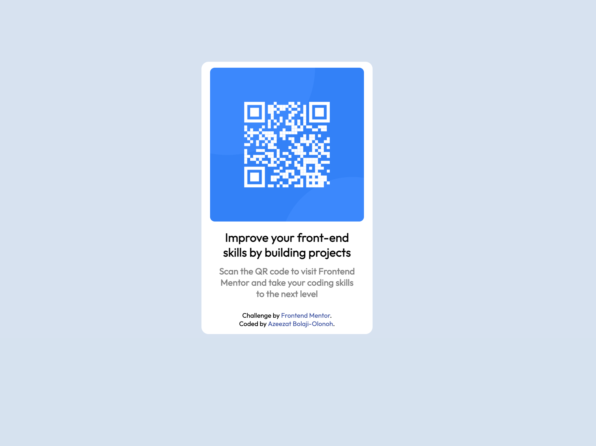

# Frontend Mentor - QR code component solution

This is a solution to the [QR code component challenge on Frontend Mentor](https://www.frontendmentor.io/challenges/qr-code-component-iux_sIO_H). Frontend Mentor challenges help you improve your coding skills by building realistic projects. 

## Table of contents

- [Overview](#overview)
  - [Screenshot](#screenshot)
  - [Links](#links)
- [My process](#my-process)
  - [Built with](#built-with)
  - [What I learned](#what-i-learned)
  - [Continued development](#continued-development)
  - [Useful resources](#useful-resources)
- [Author](#author)


## Overview
In trying to improve my web development skills as a FullStack Developer, I came across Frontend Mentor and their 
real life challenges. I started with the first challenge, which is the QR Code challenge. I look forward to more impressive 
challenges as I move along.

### Screenshot



### Links

- Solution URL: https://github.com/azeezatb-o/QR-Code-Component-using-CSS-and-Flexbox
- Live Site URL: 

## My process

### Built with

- Semantic HTML5 markup
- CSS custom properties
- Flexbox
- CSS Grid
- Mobile-first workflow

### What I learned

I learned about the responsive web design approach to creating a web, tablet and desktop version of my web pages.

```

### Continued development

Still trying to improve my web development skills in HTML, CSS, Javascript, etc and also features like the RWD.

### Useful resources

- https://www.freecodecamp.org/news/responsive-web-design-how-to-make-a-website-look-good-on-phones-and-tablets/

## Author

- Website -Azeezat Bolaji-Olonoh (https://github.com/azeezatb-o)
- Frontend Mentor - azeezatb-o (https://www.frontendmentor.io/profile/azeezatb-o)

